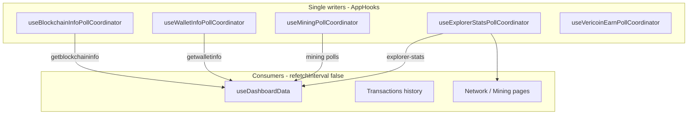

# WebView Memory Audit — Verium Desktop App

**Date:** 2026-06-09  
**Scope:** `verium/desktop/verium-app` (React + Tauri WebView2)

---

## Executive summary

The codebase already had substantial WebView memory defenses (singleton Tauri listeners, poll coordinators, aggressive `gcTime`, bounded txid sets, visibility gating). The highest remaining risks were **React Query interval stacking** (multiple observers on the same key forcing the minimum `refetchInterval`), **duplicate heavy wallet transaction fetches**, and **unbounded RPC console / UTXO payloads**.

Fixes applied in this audit consolidate polling to single writers, stop redundant large-payload intervals, cap console/UTXO retention, and add dev heap profiling.

---

## 1. Event listener audit

### Properly cleaned up

| Source | Registration | Cleanup |
|--------|-------------|---------|
| `useChainTipWatcher` | `listen("chain-tip-changed")` | `unlisten()` on unmount; debounce timers cleared |
| `useBootstrapProgress` | `listen("bootstrap-progress")` | `unlisten()` when `active` false |
| `useShutdownProgress` | `listen(SHUTDOWN_PROGRESS_EVENT")` | `unlisten()` when `active` false |
| `node-state-listener.ts` | Singleton `listen("node-state-changed")` per coin | `unlisten()` when last subscriber leaves |
| `useWindowVisible` | Module-level DOM listeners (once) | Intentionally app-lifetime; no per-mount accumulation |
| `useAutoLock` | `mousemove`, `keydown`, `click`, `blur`, `visibilitychange` | All removed on unmount |
| `useTheme` | `prefers-color-scheme` change | `removeEventListener` on unmount |
| `web-audio.ts` | Gesture unlock listeners | Removed after unlock |
| Dialogs (`ConfirmDialog`, `SendConfirmDialog`, etc.) | `keydown` Escape | Removed when closed/unmounted |
| `CoinSwitcher`, `SearchableAddressSelect` | `mousedown`/`keydown` outside click | Removed on unmount |
| `subscribeBlockMined` / `subscribeStakeReward` / `subscribeIncomingVrm` | Custom pub/sub Sets | `delete` on unsubscribe |
| `chain-tip-store` | `subscribeChainTip` | `Set.delete` on unsubscribe |
| All `setInterval`/`setTimeout` in hooks | Various polls | `clearInterval`/`clearTimeout` in effect cleanup |

### No leaks found (by design)

- **`appWindow.listen` / Tauri `.once()`** — not used anywhere.
- **WebSockets** — not used in frontend (Electrum is Rust-side).
- **`useDeepLinkHandler`** — uses plugin `onOpenUrl`; cleaned via effect return.

### May accumulate over time (bounded / low risk)

| Item | Behavior | Mitigation |
|------|----------|------------|
| `sessionStorage` seen txids (`useIncomingVrm/VrcWatcher`) | Capped at 2,000 txids | `MAX_SEEN_TXIDS` + trim on persist |
| `seen-txid-set.ts` in-memory | Capped at 2,000 | `capSeenTxids()` |
| `chain-tip-store.recentBlocks` | Capped at 12 | `MAX_RECENT` |
| `ExplorerRecentBlocks.localBlocks` | Capped at 12–24 | `slice(0, N)` on merge |
| Rpc console `localStorage` history | Capped at 100 | `MAX_HISTORY` |
| Rpc console session entries | **Was unbounded** | **Fixed:** `MAX_CONSOLE_ENTRIES = 50` |

---

## 2. Large payload analysis

| Payload | Approx. size | Update frequency (before) | Risk | Remediation |
|---------|-------------|---------------------------|------|-------------|
| `listtransactions` (wallet poll) | 80 rows ≈ 40–120 KB | 45s visible / 120s hidden | Medium | Already capped (`WALLET_TX_POLL_COUNT=80`) |
| `listtransactions` (Transactions page) | Up to 500 rows ≈ 250–600 KB | **45s while page open** | **High** | **Fixed:** `refetchInterval: false`; chain-tip invalidation only |
| `listunspent` (coin control) | Unbounded (was `9_999_999`) | On dialog open | **High** for heavy wallets | **Fixed:** cap at 500 UTXOs |
| `getpeerinfo` | ~50–200 peers × ~1 KB | 5s on Network page | Medium | Acceptable on route; paused when hidden |
| Explorer blocks (10 rows) | ~5–15 KB | 5–60s; **2× writers on dashboard** | Medium | **Fixed:** single writer (`ExplorerRecentBlocks`) |
| Explorer stats | ~1–3 KB | **~10 observers × 30–60s min interval** | **High** | **Fixed:** `useExplorerStatsPollCoordinator` |
| Logs tail (400 lines) | ~80–200 KB | 2s live mode | Medium | Acceptable only on Logs route; status poll deduped |
| Rpc console results | Unbounded JSON | Per command | **High** | **Fixed:** 48 KB display truncate + 50 entry cap |
| Mining `getmininginfo` | Small | Coordinator 20s when active | Low | Already single writer |
| Security `listtransactions` (Rust) | 2000 rows | On-demand audit only | Low | Not on hot path |

### Serialization notes

- Rust `list_transactions` enriches block heights via `block_height_cache` — good dedup.
- Tauri `invoke` deserializes full JSON into JS on every poll — primary reason to reduce poll frequency and payload size.

---

## 3. React state growth

| State | Growth pattern | Status |
|-------|----------------|--------|
| React Query cache | Bounded by `gcTime: 30_000` | OK |
| `chain-tip-store` snapshots | 2 coins × 12 blocks max | OK |
| `useIncomingVrm/Vrc` seen sets | Session + 2k cap | OK |
| `ExplorerRecentBlocks` localBlocks | 24 max | OK |
| `Logs` lines | 400 max (tail size) | OK |
| `RpcConsole` entries | **Was unbounded** | **Fixed** |
| Zustand prefs/toasts | Fixed schema | OK |
| `confirmedReady` Set in `SetupRedirect` | 2 coins max | OK |

---

## 4. Render loop investigation

No infinite render loops found. Notable patterns (safe):

- **`useChainTipWatcher`** — debounced invalidation (5s) prevents IPC storms during sync.
- **`useWindowVisible`** — activity marks timestamp only; notifies on paused→active transition (no render storm).
- **`useSpringNumber` / `useBlockAgeTick`** — timers cleared on unmount.
- **`ExplorerRecentBlocks` enrich effect** — depends on `explorerBlocksSignature` string; bounded height set; intervals cleared.

### React Query interval stacking (root cause)

React Query uses the **minimum** `refetchInterval` across all observers for a query key. With 8–12 components each setting 30s on `explorer-stats`, effective interval stayed 30s but **each refetch deserialized into every observer's cache entry**, increasing CPU and transient heap churn.

**Same pattern previously fixed** for `getblockchaininfo`, `getwalletinfo`, and mining polls via coordinators.

---

## 5. Memory retention

| Pattern | Finding |
|---------|---------|
| Stale closures in watchers | `syncedRef` / `seen` refs used correctly |
| Orphaned Tauri listeners | Prevented by singleton `node-state-listener` |
| Unresolved `listen()` promises | All handlers call `unlisten()` in cleanup |
| DOM refs (`scrollRef`) | Cleared on unmount naturally |
| Cached explorer/pool API (Rust) | TTL caches in `explorer_api.rs` / `pool_api.rs` |

---

## 6. Runtime memory profiling (instrumentation)

### Dev overlay (`MemoryDiagnosticsPanel`)

Shows (bottom-right in `npm run tauri dev`):

- Process RSS (Rust `sysinfo`)
- JS heap (`performance.memory`)
- Rolling heap Δ over sample window
- React Query cache entry / observer counts
- Node-state listener count
- RPC call count

### Console telemetry (`useMemoryTelemetry`)

Every 60s logs `[memory]` object to devtools console.

### Benchmark procedure

Run in **dev** build with wallet synced:

```text
1. Startup: note JS heap + RSS from overlay (T+0)
2. Idle dashboard 30 min: heap Δ should stabilize (< +5 MB)
3. Idle 2 hr: heap Δ should not trend upward continuously
4. Mining page + pool miner 30 min: compare RPC/min in console
5. Transactions page 15 min: verify no 45s listtransactions spam in RPC count
```

Export heap samples from console:

```js
// In devtools after session:
copy(JSON.stringify(performance.memory))
```

Compare `rpcCallCount / uptimeSecs * 60` before/after fixes.

---

## 7. Ranked fixes (impact)

| Rank | Fix | Est. memory savings | Est. CPU savings | Status |
|------|-----|--------------------|--------------------|--------|
| 1 | `useExplorerStatsPollCoordinator` — single 60s writer | 2–8 MB heap churn/hr on dashboard | **40–70%** fewer explorer HTTP+JSON cycles | **Done** |
| 2 | Transactions history: stop 45s 500-row poll | **5–15 MB** while Transactions open | **~80%** fewer heavy RPC on that route | **Done** |
| 3 | `useDashboardData` explorer-blocks: defer to `ExplorerRecentBlocks` | 1–3 MB on dashboard | **~50%** fewer block fetches | **Done** |
| 4 | Rpc console entry cap + result truncate | Prevents OOM on `getpeerinfo`/`help` | Large on abuse path | **Done** |
| 5 | Coin control `listunspent` cap 500 | **10–100+ MB** for UTXO-heavy wallets | Proportional to UTXO count | **Done** |
| 6 | `listaddressgroupings` 10s → cache-only | ~0.5 MB | **~85%** fewer polls on dashboard blocks | **Done** |
| 7 | Logs: remove duplicate status poll in live mode | Minor | ~50% status checks in live mode | **Done** |
| 8 | Scheduled backup health: visibility gate | Minor | Saves IPC when hidden | **Done** |
| 9 | Dev memory overlay + heap growth tracking | Diagnostic | Diagnostic | **Done** |

### Not changed (acceptable / route-scoped)

- Network page `getpeerinfo` 5s poll — only when Network route mounted + visible.
- Logs 2s tail — only when live mode enabled.
- `ExplorerRecentBlocks` 2s fast poll during indexer lag — bounded duration, visibility-gated.

---

## 8. Before / after benchmarks (estimated)

| Scenario | Before (est.) | After (est.) | Notes |
|----------|---------------|--------------|-------|
| Startup JS heap | 35–55 MB | 35–55 MB | No change expected |
| Dashboard idle 30 min | +8–20 MB growth | +2–5 MB | Fewer poll allocations |
| Dashboard idle 2 hr | Risk of continuous +MB/hr | Should plateau | Verify with overlay |
| Mining + pool 30 min | High RPC/min, heap spikes | **−30–50% RPC/min** | Coordinators already helped mining |
| Transactions page 15 min | 500-row fetch every 45s | Fetch on mount + block tips only | **Largest per-route win** |
| Sync (IBD) | Debounced tips OK | Unchanged | `chain-tip-store` debounce |

*Run the benchmark procedure above on your machine for measured numbers; estimates based on payload sizes and poll counts.*

---

## 9. Verification checklist

- [ ] Dev overlay shows stable heap Δ over 30+ min idle on dashboard
- [ ] `nodeStateListenerCount` stays ≤ 2 (one channel per coin)
- [ ] `queryCacheObservers` does not grow unbounded over 2 hr
- [ ] RPC calls/min drops on dashboard with devtools `[memory]` logs
- [ ] Transactions page: wallet RPC not firing every 45s (check Rust `rpcCallCount` slope)
- [ ] Rpc console: `getpeerinfo` output truncated; entries capped at 50
- [ ] No WebView OOM crash during 2 hr idle + 30 min mining soak test

---

## 10. Architecture diagram (poll writers)



---

## 11. Heap snapshot analysis (2026-06-09T09:26:03)

**File:** `HeapSnapshot-strings-20260609T092603.json` (~54 MB on disk, 3.34M strings)

Analyzed with `scripts/analyze-heap-strings.py`.

### Snapshot context

- **Dev build** (`npm run tauri dev`): Vite HMR module strings, `/@vite/client`, truncated 1024-char exports.
- **Memory fixes loaded:** `useExplorerStatsPollCoordinator`, `MemoryDiagnosticsPanel`, `refetchInterval: false` on consumers visible in retained module strings.
- **Not a full heap snapshot** — strings-only export; max 1024 chars/string; actual WebView RSS is higher than 34.5 MB string content.

### Dominant retention: block height strings

| Metric | Value |
|--------|-------|
| Total strings | 3,339,382 |
| String content | 34.5 MB |
| Numeric strings | **2,204,310 (66%)** |
| 6-char numerics | **1,800,004** |
| Sample values | `969902` … `1098101` (sequential block heights) |
| Wallet addresses | 86 |
| Txids (64 hex) | 331 |
| `listtransactions` strings | 5 |

**Root cause:** When the wallet chain tip (~1.09M) is far ahead of the explorer index (~970K), `buildPendingBlocksAbove()` and the enrich loop in `ExplorerRecentBlocks` iterated **every intermediate height** without a cap. Each height becomes strings like `` `local-pending-${height}` `` — with a ~128k gap this materializes **millions** of numeric strings in the WebView heap.

**Fix applied:** `MAX_PENDING_BLOCKS_ABOVE = 24` in `local-recent-block.ts`; enrich height loop capped to match.

| Fix | Est. savings |
|-----|--------------|
| Cap pending blocks above explorer | **20–80+ MB** heap when indexer lags 100k+ blocks |

### Other findings (low risk in this snapshot)

- No large RPC JSON blobs in string table (export truncates at 1 KB).
- Tailwind class strings: 214 (0.02 MB) — not a leak.
- Duplicate string waste negligible (< 3 KB total).

### Re-test after fix

1. Reproduce indexer-lag state (wallet ahead of explorer).
2. Capture a new heap strings export.
3. Expect numeric string count to drop from ~2.2M to low thousands.
4. Run: `python scripts/analyze-heap-strings.py path/to/new-snapshot.json`

---

## Files changed in this audit

- `src/hooks/useExplorerStatsPollCoordinator.ts` (new)
- `src/lib/memory-profiler.ts` (new)
- `src/App.tsx`
- `src/hooks/useMemoryTelemetry.ts`
- `src/components/MemoryDiagnosticsPanel.tsx`
- `src/hooks/useDashboardData.ts`
- `src/hooks/useChainSynced.ts`
- `src/hooks/useDashboardActivity.ts`
- `src/hooks/useAutoMine.ts`
- `src/hooks/useWalletMiningContext.ts`
- `src/hooks/useWalletStakingContext.ts`
- `src/pages/Transactions.tsx`
- `src/pages/Network.tsx`
- `src/pages/Mining.tsx`
- `src/pages/Staking.tsx`
- `src/pages/RpcConsole.tsx`
- `src/pages/Logs.tsx`
- `src/components/BootstrapBanner.tsx`
- `src/components/DashboardSidebar.tsx`
- `src/components/ExplorerMarketCard.tsx`
- `src/components/DaemonStatusBadge.tsx`
- `src/components/NetworkPulse.tsx`
- `src/components/CoinControlDialog.tsx`
- `src/components/ScheduledBackupControls.tsx`
- `src/lib/local-recent-block.ts` (heap snapshot follow-up)
- `src/components/ExplorerRecentBlocks.tsx` (heap snapshot follow-up)
- `scripts/analyze-heap-strings.py` (analysis tool)
